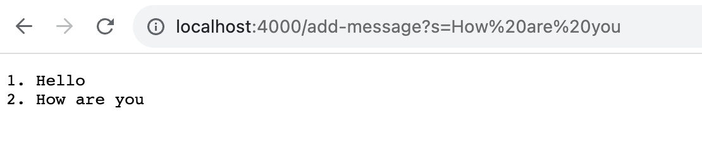
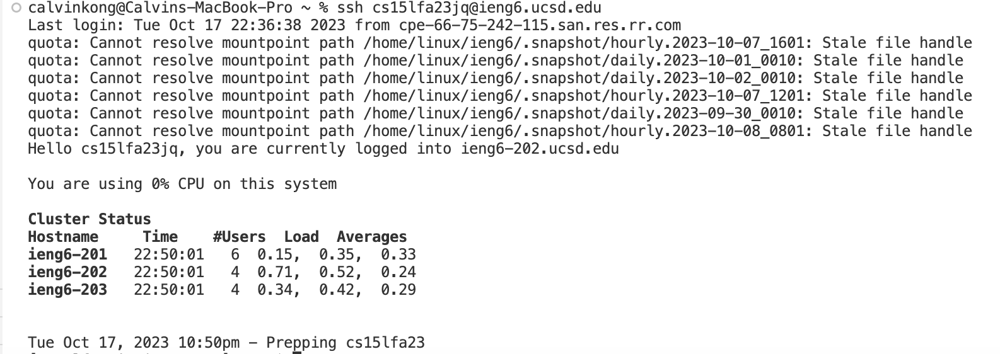

# Part 1
## StringServer.java code

```
import java.io.IOException;
import java.net.URI;

class Handler implements URLHandler {
    // The one bit of state on the server: a number that will be manipulated by
    // various requests.
    int num = 0;
    String result = "";

    public String handleRequest(URI url) {

        if (url.getPath().contains("/add-message")) {
            String[] parameters = url.getQuery().split("=");
            num+=1;
            String str = String.format("%d. "+ parameters[1] + "\n", num);
            result += str;
            return result;
        }
        return "";
    }
}

class StringServer {
    public static void main(String[] args) throws IOException {
        if(args.length == 0){
            System.out.println("Missing port number! Try any number between 1024 to 49151");
            return;
        }

        int port = Integer.parseInt(args[0]);

        Server.start(port, new Handler());
    }
}
```

## First add message


When the program runs, the main method runs with the args as the port number 4000. Then when changing the url, the handleRequest is called with the argument being new URI("http://localhost:4000/add-message?s=Hello"). The field num is changed from 0 to 1 and the field result changes from an empty string to "1. Hello"


## Second add message


When the program runs, the main method runs with the args as the port number 4000. Then when changing the url, the handleRequest is called with the argument being new URI("http://localhost:4000/add-message?s=How%20are%20you:). The field num is changed from 1 to 2 and the field result changes from "1. Hello" to "1. Hello\n2. How are you"

# Part 2
## Path to private key


## Path to public key


## Login without password



# Part 3

I learned how to create an SSH key pair and copy the key to a remote server using scp. This enabled passwordless SSH authentication. I also learned how to use to process the url of a webserver and make changes to the webserver based on the contnets of the url. 


